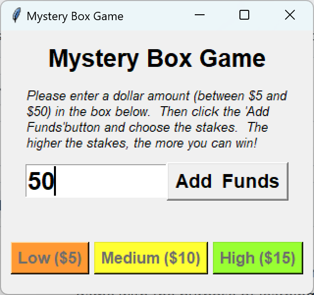
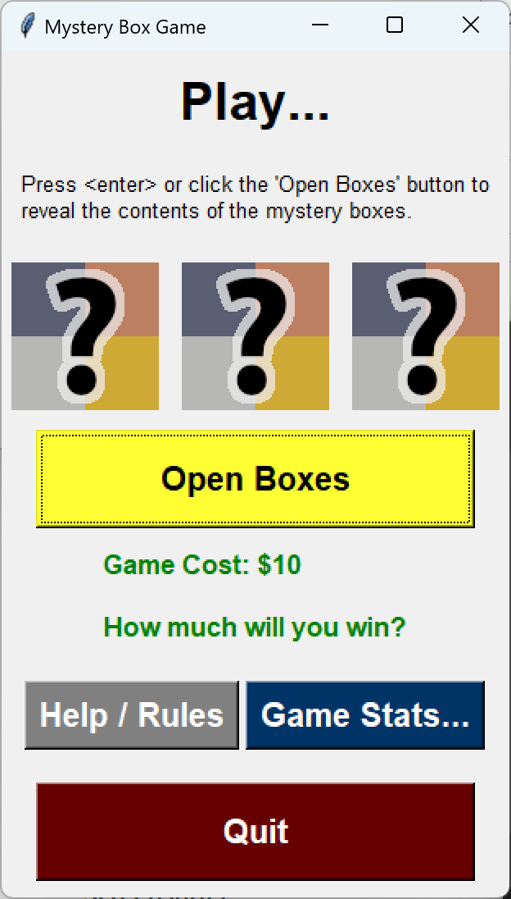
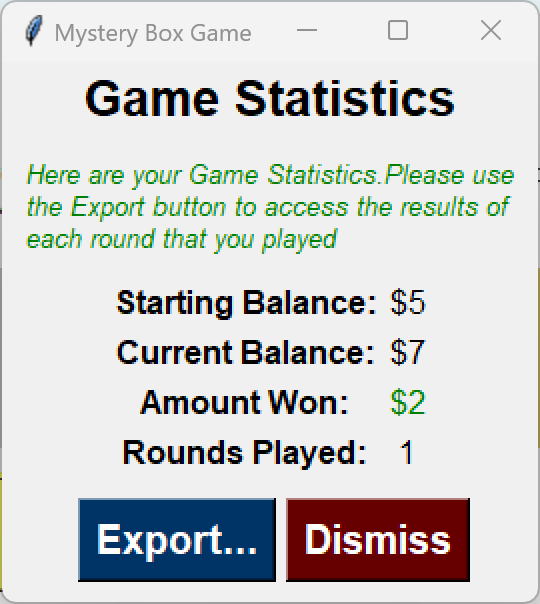

# Mystery Box Game
Mystery Box Game was created for my Digital Technologies class while in Year 13 of high school. We had 3 weeks worth of classes to create this game with the purpose of learning more advanced python as well as how to use tkinter to create GUI windows with text and images.

The plan for writing the code was to let each GUI window has its own class. This simple structure helped with readability and bug fixing as I immediately knew which section of the code to look at.

**Dependencies:**
* tkinter
* functools
* random
* re

**Screenshots:**

    

After creating this, I moved on to creating MeasurementConverter, which was my assessed python tkinter application. I received an Excellence grade for my 'iterative improvement' (planning, documenting changes) and a Merit grade for the program overall.

Next time, I would make the game more fair and make it possible to win while also allowing the player to put more money in. This game was based around an 'anti-gambling' theme so the it was intentionally designed to be unfair to dissuade players from practicing gambling in real life, so this caused some limitations.

To play the game, run game.exe which is located in the src folder.
